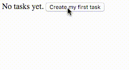

# vue-js-on-submit-bug
A replication of on-submit *bug*.

### Elaboration
Clicking "enter" on an input (this triggers the `on:submit` event) does not remove the data from the input, while clicking the `submit` button does.


### Running
```bash
npm install
npm run build # or npm run watch
open index.html
```

### Note
Hello, I wrote this while being awake for around 18 hours (because Vue suddenly caused an *itch*). That said, I did a lot of patterns which I did not understand.

Feel free to point them out.